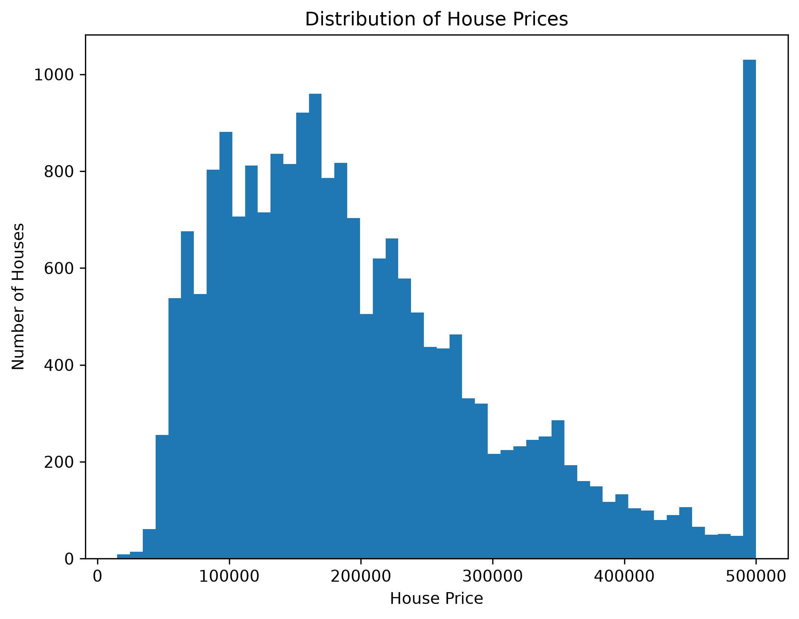
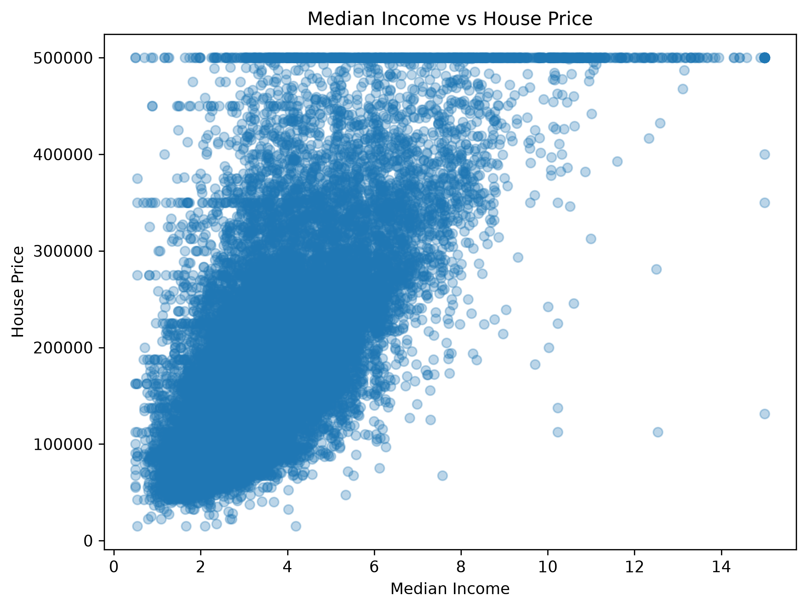
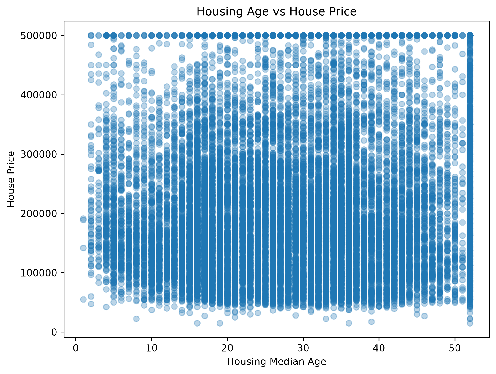
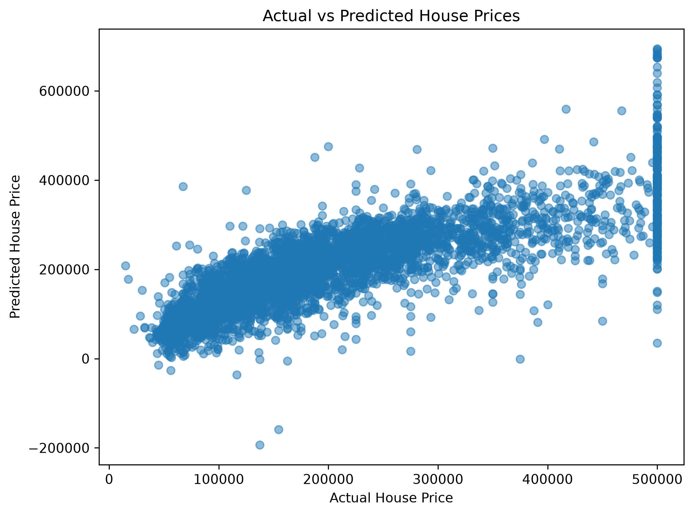
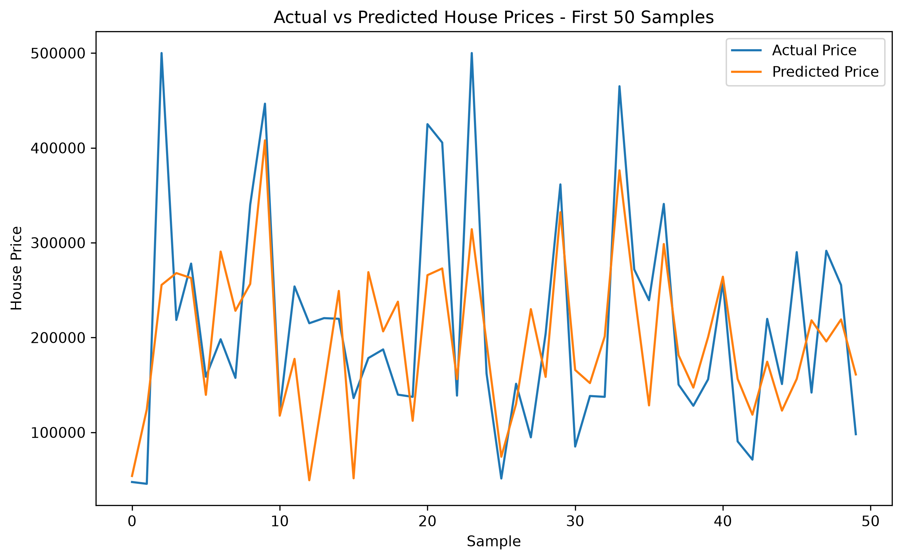

# 🏠 House Price Prediction

A Machine Learning project that predicts house prices using **Linear Regression** and a California Housing dataset.


---

## 📌 Problem Statement

House prices depend on several factors such as location, income, number of rooms, population, housing age, and proximity to the ocean.

The goal of this project is to build a Machine Learning model that can predict the **median house value** based on these features.

---

## 🎯 Objective

The main objectives of this project are:

- Clean and preprocess the housing dataset.
- Analyze the dataset using Exploratory Data Analysis (EDA).
- Convert categorical data into numerical data.
- Train a Linear Regression model.
- Evaluate the model using R² Score, RMSE, and MAE.
- Save the trained model using Joblib.
- Deploy the model using Flask.
- Provide a simple web interface for house price prediction.

---

## 🗂️ Dataset

This project uses the **California Housing dataset**.

### Dataset Information

| Property | Value |
|---|---:|
| Total Rows | 20,640 |
| Original Columns | 10 |
| Input Features After Encoding | 13 |
| Target Variable | `median_house_value` |

### Main Features

- Longitude
- Latitude
- Housing Median Age
- Total Rooms
- Total Bedrooms
- Population
- Households
- Median Income
- Ocean Proximity

### Target

```text
median_house_value
```

---

## 🔄 Project Workflow

```text
Dataset
   ↓
Data Cleaning
   ↓
Exploratory Data Analysis
   ↓
Missing Value Handling
   ↓
Categorical Encoding
   ↓
Train/Test Split
   ↓
Linear Regression
   ↓
Prediction
   ↓
Model Evaluation
   ↓
Model Saving
   ↓
Flask Web Application
```

---

## 🧹 Data Cleaning

The dataset was checked and cleaned before training the model.

### Missing Values

The `total_bedrooms` column contained missing values.

Missing values were replaced using the median:

```python
df["total_bedrooms"] = df["total_bedrooms"].fillna(
    df["total_bedrooms"].median()
)
```

### Duplicate Values

Duplicate records were also checked.

---

## 📊 Exploratory Data Analysis

### 1. House Price Distribution



This graph shows the distribution of house prices in the dataset.

---

### 2. Median Income vs House Price



This graph shows the relationship between median income and house prices.

---

### 3. Housing Age vs House Price



This graph shows the relationship between housing age and house prices.

---

## 🛠️ Feature Engineering

The categorical feature `ocean_proximity` was converted into numerical features using **One-Hot Encoding**.

```python
X = pd.get_dummies(
    X,
    columns=["ocean_proximity"],
    dtype=int
)
```

After encoding:

```text
Features = 13
```

---

## 🤖 Model Building

### Algorithm

**Linear Regression**

The model learns the relationship between the input features and the target house price.

```python
model = LinearRegression()

model.fit(X_train, y_train)
```

### Train/Test Split

The dataset was divided into:

- **80% Training Data**
- **20% Testing Data**
- `random_state = 42`

---

## 📈 Model Performance

The model was evaluated using three metrics.

| Metric | Score |
|---|---:|
| R² Score | 0.6254 |
| RMSE | 70,060.52 |
| MAE | 50,670.74 |

### What these metrics mean

**R² Score:** Measures how well the model explains the variation in house prices.

**RMSE:** Measures the average magnitude of prediction errors, giving larger errors more weight.

**MAE:** Measures the average absolute difference between actual and predicted prices.

---

## 📉 Actual vs Predicted House Prices



This graph compares the actual house prices with the prices predicted by the Linear Regression model.

---

## 📊 Prediction Comparison



This graph compares actual and predicted prices for the first 50 test samples.

---

## 💾 Model Saving

The trained model is saved using **Joblib**:

```python
joblib.dump(model, "house_price_model.pkl")
```

The saved model is then loaded by the Flask application to make predictions.

---

## 🌐 Flask Web Application

The trained Machine Learning model is integrated with a Flask web application.

Users can enter house-related information through the web interface and receive a predicted house price.

### Main Flask Files

```text
app.py
templates/index.html
static/style.css
house_price_model.pkl
```

---

## 📁 Project Structure

```text
House-price-prediction/
│
├── app.py
├── README.md
├── requirements.txt
├── housing.csv
├── house_price_model.pkl
├── housepriceprediction.ipynb
│
├── house_price_distribution.png
├── income_vs_house_price.png
├── housing_age_vs_price.png
├── actual_vs_predicted.png
├── actual_vs_predicted_line.png
│
├── static/
│   └── style.css
│
└── templates/
    └── index.html
```

---

## 🧰 Technologies Used

- Python
- Pandas
- NumPy
- Matplotlib
- Scikit-learn
- Joblib
- Flask
- HTML
- CSS
- Git
- GitHub

---

## ▶️ How to Run the Project

### 1. Clone the Repository

```bash
git clone https://github.com/rachit45/house-price-prediction.git
```

### 2. Open the Project Folder

```bash
cd house-price-prediction
```

### 3. Create Virtual Environment

```bash
python -m venv .venv
```

### 4. Activate Virtual Environment on Windows

```bash
.venv\Scripts\activate
```

### 5. Install Required Libraries

```bash
pip install -r requirements.txt
```

### 6. Run Flask Application

```bash
python app.py
```

### 7. Open the Local Website

Open the local address displayed in your terminal, usually:

```text
http://127.0.0.1:5000/
```

---

## 📓 Jupyter Notebook

The complete Machine Learning workflow is available in:

```text
housepriceprediction.ipynb
```

The notebook includes:

- Dataset loading
- Data cleaning
- EDA
- Visualization
- Feature preparation
- Model training
- Prediction
- Model evaluation
- Model saving

---

## 📌 Key Findings

- Median income has a strong relationship with house prices.
- Location-related features contribute significantly to prediction.
- Missing values were successfully handled.
- Categorical data was converted using One-Hot Encoding.
- Linear Regression achieved an R² score of approximately **0.6254**.
- The trained model can be used through the Flask web application.

---

## 👨‍💻 Author

### Rachit Mishra

**GitHub:**  
https://github.com/rachit45

**LinkedIn:**  
https://www.linkedin.com/in/rachit-mishra-932753330

---

## 📄 License

This project is released under the **MIT License**.